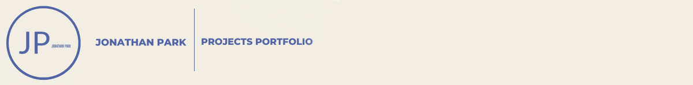

<html lang="en">
<head>
	<meta charset="utf-8">
	<link href="assets/css/boilerplate.css" rel="stylesheet" type="text/css">
	<link href="assets/css/styles.css" rel="stylesheet" type="text/css">
	<link href="styles.css" rel="stylesheet" type="text/css">
	<title> Contact Me! </title>
	<link rel="icon" href="assets/coding_icon.png">
</head>
<body>

<header>
	
</header>

	<nav class="fluid nav_ul" style="text-align: center" >
		<a href="index.html"> Index </a> - 
		<a href="about.md"> About Me </a> - 
		<a href="Services.md"> Services </a> -
		<a href="Contact.md"> Contact </a>
	</nav>

	
	<a href="http://www.freepik.com" style="text-align:center">Designed by stories / Freepik</a>
	<h1>Please contact me!</h1>
  
Generally, I should be available to contact!

  
Leave your contact and inquiries below:
 

<form action="action_page.php" method="post">
	<label for="First_Name">First Name:</label>
		<input type="text" id="First_Name" name="First_Name">  

	<label for="Last_Name">Last Name:</label>
		<input type="text" id="Last_Name" name="Last_Name">  
	
	<label for="Email">*Email:</label>
		<input type="text" id="Email" name="Email" required >  
		
	<label for="Messages">*Tell me what you want to say!</label> 
	<textarea id="Messages" name="Messages" placeholder="Write here!" required></textarea> 
	
*Important boxes you need to fill!

	<input type="Submit" value="Submit" >
</form>

	<h3>Here are my handles!</h3>
		
		
		

	
		Copyright 2023  
		Last updated on February 19, 2023
	

</body>
</html>
